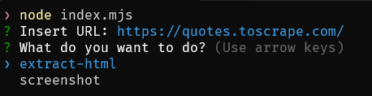

# Welcome to Node Web Scraper with Playwright
## Este programa busca ofrecer una forma sencilla de scrapear webs sin conocimiento en el Scraping

> [!IMPORTANT]
> El web scraping es una tecnica que en algunos sitios webs puede ser ilegal, por lo que se recomienda hacer esto con web propias o con permiso del propietario de la misma.

**Instalacion**

Usted necesitara de un manejador de paquetes de Nodejs (npm, pnpm, bun).
El programa maneja 3 dependencias:

- [Inquirer](https://www.npmjs.com/package/inquirer) @10.1.8
- [PlayWright](https://www.npmjs.com/package/playwright) @1.46.0
- [Picocolors](https://www.npmjs.com/package/picocolors) @1.0.1

*si siente curiosidad por estas depedencias puede consultar la documentacion de cada una como conocer mas en la pagina de NPM*

Cada una comple una funcion dentro del ciclo de ejecucion explicado mas adelante, *Inquirer* se usa para interactuar con usted atraves de la terminal mediante preguntas; *Playwright* se bastante esencial ya que es la dependencia atravez de la cual hacemos scraping; *Picocolors* se usa para embellecer las salidas en la terminal.

| npm | pnpm | bun|
|-------------|--------------|-------------|
| npm install | pnpm install | bun install |


**Funcionamiento**

Una vez usted ejecute el comando de inicio ```npm run index.mjs``` o ```npm run start``` (esto asumiendo que usa npm en caso de que use otro la forma de ejecucion no cambia muchom puede verifiar en la documentacion de su manejador de paquetes), se le pedira que inserte cierta informacion.

- Insert URL (inserte la url de la web)
- What do you want to do? (¿Que quieres hacer?)

Deberia ver algo mas o menos asi:





La seguna pregunta le cuestion que quiere hacer en la web, las opciones van desde tomar una screenshot hasta extraer todo el contenido HTML **(sin estilos)**.

**extract-html**